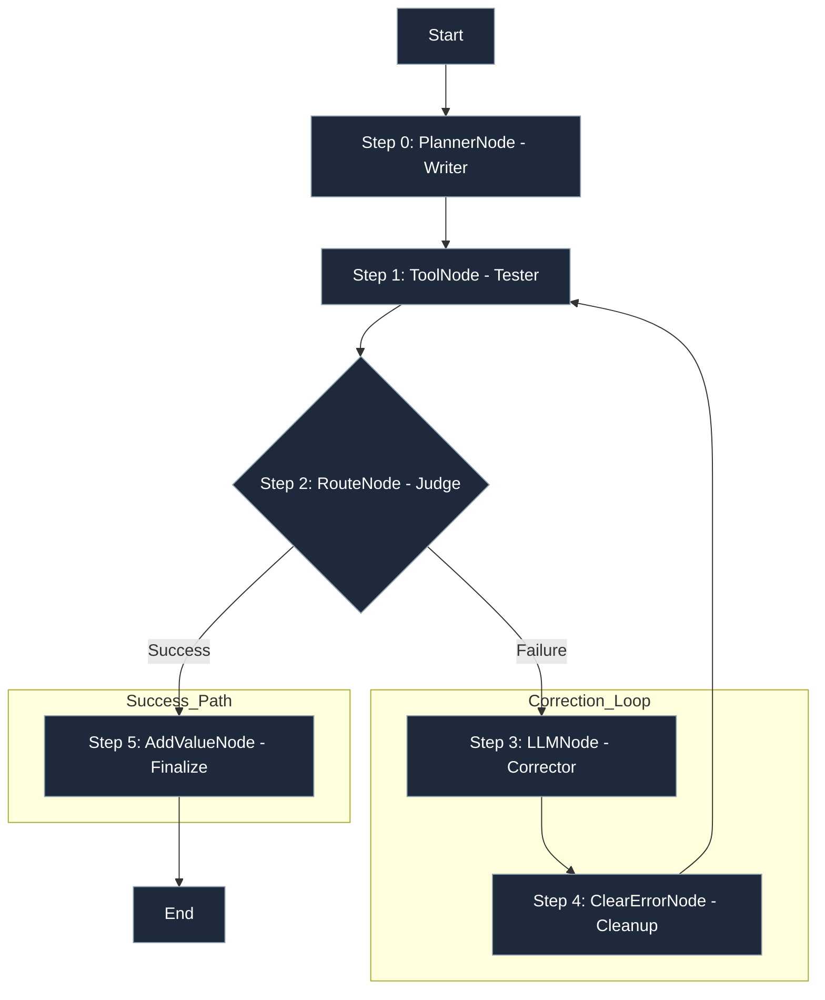
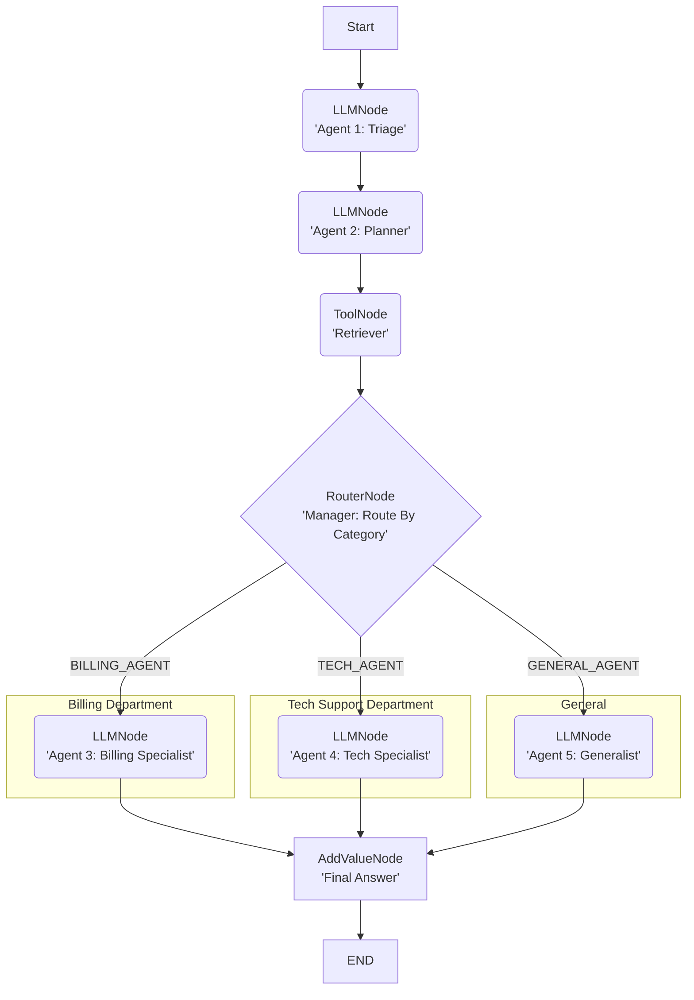

<p align="center">
  
</p>
<p align="center"><em>Lár: The Pytorch for Agents</em></p>
<p align="center">
  <a href="https://pypi.org/project/lar-engine/">
    
  </a>
  <a href="https://pypi.org/project/lar-engine/">
    

  <a href="https://www.linkedin.com/company/snathai/">
    
  </a>
  <a href="https://github.com/sponsors/axdithyaxo">
    
  </a>
</p>

# Lár: The PyTorch for Agents

> **Need to run this in production with Auth, Air-Gap, and Human-in-the-Loop? Check out [Snath Cloud](https://snath.ai/cloud).**

**Lár** by **SnathAI™** is the open source standard for **Deterministic, Auditable, and Air-Gap Capable** AI agents.

**Lár** (Irish for "core") is engineered for **Regulated Environments** (BioMed, Gov, FinTech). Unlike "chatbot" frameworks that offer "magic" black boxes, Lár implements a **"Glass Box"** architecture. It produces **21 CFR Part 11-ready audit trails** out of the box and essentially brings the **Scientific Method** to AI agents.

-----
**Full Documentation**
[https://docs.snath.ai](https://docs.snath.ai)

## Core Philosophy: "Glass Box" vs. "Black Box"

The primary challenge in production-grade AI is a lack of traceability. When a multi-step agent fails, it's often impossible to determine *why*.

  * **The "Black Box" (Other Frameworks):** Relies on a "magic" `AgentExecutor` that tries to do everything at once. When this magic fails, it's a complex black box that is nearly impossible to debug.

  * **The "Glass Box" (Lár):**  Lár is, by design, a simple, explicit loop. The `GraphExecutor` runs one node at a time, logs the exact state change, and then pauses. It supports all major LLMs (OpenAI, Anthropic, Gemini, etc.) via a unified adapter.

This "define-by-run" approach transforms debugging from an art into a science. You can visually trace the execution, inspect the diff of the state at every transition, and pinpoint the exact node where logic failed. Lár's **"Flight Log"** (`history`) isn't an add-on; it's the core output of the engine.


## Why `Lár` is Better: The "Glass Box" Advantage

The Problem | "Black Box" Frameworks (e.g., LangChain)| Lár (The "Glass Box" Engine) |
|------|-------------------------|-------------------|
| Debugging | A Nightmare. When an agent fails, you get a 100-line stack trace from inside the framework's "magic" AgentExecutor. You have to guess what went wrong.| Instant & Precise. Your history log is the debugger. You see the exact node that failed (e.g., ToolNode), You see the exact error (APIConnectionError), and the exact state that caused it. |
| Auditability | External & Paid. "What happened?" is a mystery. You need an external, paid tool like LangSmith to add a "flight recorder" to your "black box." | Built-in & Free. The **"Flight Log"** (history log) is the core, default, open-source output of the GraphExecutor. You built this from day one. |
| Multi-Agent Collaboration | Chaotic "Chat Room." Agents are put in a room to "talk" to each other. It's "magic," but it's uncontrollable. You can't be sure who will talk next or if they'll get stuck in a loop. | Deterministic "Assembly Line." You are the architect. You define the exact path of collaboration using RouterNode and ToolNode. |
| Deterministic Control | None. You can't guarantee execution order. The "Tweeter" agent might run before the "Researcher" agent is finished. | Full Control. The "Tweeter" (LLMNode) cannot run until the "RAG Agent" (ToolNode) has successfully finished and saved its result to the state. |
| Data Flow | Implicit & Messy. Agents pass data by "chatting." The ToolNode's output might be polluted by another agent's "thoughts." | Explicit & Hard-Coded. The data flow is defined by you: RAG Output -> Tweet Input. The "Tweeter" only sees the data it's supposed to. |
| Resilience & Cost | Wasteful & Brittle. If the RAG agent fails, the Tweeter agent might still run with no data, wasting API calls and money. A loop of 5 agents all chatting can hit rate limits fast. | Efficient & Resilient. If the RAG agent fails, the Tweeter never runs. Your graph stops, saving you money and preventing a bad output. Your LLMNode's built-in retry handles transient errors silently. |
| Core Philosophy | Sells "Magic." | Sells "Trust." |
| **Compliance & security** | **Non-Compliant.** Cloud-dependent tracing. Non-deterministic execution makes FDA validation impossible. | **GxP-Ready.** Lár supports features needed for 21 CFR Part 11-aligned workflows. **Air-Gap Capable** via JSON serialization for SCIF environments. |

> **Visualizing the Difference:**
> * **Others:** A tangled web of implicit dependencies ("Spaghetti Code").
> * **Lár:**  A linear, distinct assembly line of logic.

## Key Features

  * **Define-by-Run Architecture:** The execution graph is created dynamically, step-by-step. This naturally enables complex, stateful logic like loops and self-correction.

  * **Total Auditability:** The `GraphExecutor` produces a complete, step-by-step history of every node executed, the state *before* the run, and the state *after*.

  * **Deterministic Logic:** Replace "prompt-chaining" with explicit, testable Python code. Use the `RouterNode` for clear, auditable "if/else" branching.

  * **Testable Units:** Every node is a standalone class. You can unit test your `ToolNode` (your "hands") and your `RouterNode` (your "logic") completely independently of an LLM call.

  

-----


### A Simple Self-Correcting Loop



-----


## The `Lár` Architecture: Core Primitives

You can build any agent with four core components:

1.  **`GraphState`**: A simple, unified object that holds the "memory" of the agent. It is passed to every node, allowing one node to write data (`state.set(...)`) and the next to read it (`state.get(...)`).

2.  **`BaseNode`**: The abstract class (the "contract") for all executable units. It enforces a single method: `execute(self, state)`. The `execute` method's sole responsibility is to perform its logic and return the *next* `BaseNode` to run, or `None` to terminate the graph.

3.  **`GraphExecutor`**: The "engine" that runs the graph. It is a Python generator that runs one node, yields the execution log for that step, and then pauses, waiting for the next call.

4.  **Node Implementations**: The "building blocks" of your agent.

      * **`LLMNode`**: The "Thinker." Calls any major LLM API (e.g., Gemini, GPT-4, Claude) to generate text... to generate text, modify plans, or correct code. **Now supports `generation_config` for controlling creativity (temperature, top_p).**
      * **`ToolNode`**: The "Actor." Executes any deterministic Python function (e.g., run code, search a database, call an API). It supports separate routing for `success` and `error`.
      * **`RouterNode`**: The "Choice." Executes a simple Python function to inspect the state and returns a string key, which deterministically routes execution to the next node. This is your "if/else" statement.
      * **`ClearErrorNode`**: A utility node that cleans up state (e.g., removes `last_error`) to prevent infinite loops.

-----

## Example "Glass Box" Audit Trail

You don't need to guess why an agent failed. `lar` is a "glass box" that provides a complete, auditable log for every run, especially failures.

This is a **real execution** log from a lar-built agent. The agent's job was to run a "Planner" and then a "Synthesizer" (both LLMNodes). The GraphExecutor caught a fatal error, gracefully stopped the agent, and produced this perfect audit trail.

**Execution Summary (Run ID: a1b2c3d4-...)**
| Step | Node | Outcome | Key Changes |
| :--- | :--- | :--- | :--- |
| 0 | `LLMNode` | `success` | `+ ADDED: 'search_query'` |
| 1 | `ToolNode` | `success` | `+ ADDED: 'retrieved_context'` |
| 2 | `LLMNode` | `success` | `+ ADDED: 'draft_answer'` |
| 3 | `LLMNode` | **`error`** | **`+ ADDED: 'error': "APIConnectionError"`** |

**This is the `lar` difference.** You know the *exact* node (`LLMNode`), the *exact* step (3), and the *exact reason* (`APIConnectionError`) for the failure. You can't debug a "black box," but you can **always** fix a "glass box."


## Installation

This project is managed with [Poetry](https://python-poetry.org/).

1.  **Clone the repository:**

    ```bash
    git clone https://github.com/snath-ai/lar.git
    cd lar
    ```

2. **Set Up Environment Variables**
Lár uses the unified LiteLLM adapter under the hood. This means if a model is supported by LiteLLM (100+ providers including Azure, Bedrock, VertexAI), it is supported by Lár.

Create a `.env` file:

```bash
# Required for running Gemini models:
GEMINI_API_KEY="YOUR_GEMINI_KEY_HERE" 
# Required for running OpenAI models (e.g., gpt-4o):
OPENAI_API_KEY="YOUR_OPENAI_KEY_HERE"
# Required for running Anthropic models (e.g., Claude):
ANTHROPIC_API_KEY="YOUR_ANTHROPIC_KEY_HERE"
```

3.  **Install dependencies:**
    This command creates a virtual environment and installs all packages from `pyproject.toml`.

    ```bash
    poetry install
    ```

-----

## Example: Multi-Agent Orchestration (A Customer Support Agent)

The *real* power of `lar` is not just loops, but **multi-agent orchestration.**

Other frameworks use a "chaotic chat room" model, where agents *talk* to each other and you *hope* for a good result. `lar` is a deterministic **"assembly line."** You are the architect. You build a "glass box" graph that routes a task to specialized agents, guaranteeing order and auditing every step.

### 1. The "Glass Box" Flowchart

This is the simple, powerful "Customer Support" agent we'll build. It's a "Master Agent" that routes tasks to specialists.



# Lár Engine Architecture: The Multi-Agent Assembly Line

### The core of this application is a Multi-Agent Orchestration Graph. `Lár` forces you to define the assembly line, which guarantees predictable, auditable results.

### 1. Graph Flow (Execution Sequence)

The agent executes in a fixed, 6-step sequence. The graph is `defined backwards` in the code, but the execution runs forwards:

| Step        | Node Name         | Lár Primitive | Action                                                                                   | State Output       |
|-------------|-------------------|---------------|-------------------------------------------------------------------------------------------|--------------------|
| 0 (Start)   | triage_node       | LLMNode       | Classifies the user's input (`{task}`) into a service category (BILLING, TECH, etc.).     | category           |
| 1           | planner_node      | LLMNode       | Converts the task into a concise, high-quality search query.                              | search_query       |
| 2           | retrieve_node     | ToolNode      | Executes the local FAISS vector search and retrieves the relevant context.                | retrieved_context  |
| 3           | specialist_router | RouterNode    | Decision point. Reads the category and routes the flow to the appropriate specialist.     | (No change; routing) |
| 4           | billing/tech_agent| LLMNode       | The chosen specialist synthesizes the final answer using the retrieved context.           | agent_answer       |
| 5 (End)     | final_node        | AddValueNode  | Saves the synthesized answer as `final_response` and terminates the graph.                | final_response     |

### 2. Architectural Primitives Used

This demo relies on the core Lár primitives to function:

- `LLMNode`: Used 5 times (Triage, Plan, and the 3 Specialists) for all reasoning and synthesis steps.

- `RouterNode`: Used once (specialist_router) for the deterministic if/else branching logic.

- `ToolNode`: Used once (retrieve_node) to securely execute the local RAG database lookup.

- `GraphExecutor`: The engine that runs this entire sequence and produces the complete audit log

### This is the full logic from `support_app.py`. It's just a clean, explicit Python script.

```python 
'''
====================================================================
    ARCHITECTURE NOTE: Defining the Graph Backwards
    
    The Lár Engine uses a "define-by-run" philosophy. Because a node 
    references the *next_node* object (e.g., next_node=planner_node),
    the nodes MUST be defined in Python in the REVERSE order of execution 
    to ensure the next object already exists in memory.
    
    Execution runs: START (Triage) -> END (Final)
    Definition runs: END (Final) -> START (Triage)
====================================================================

'''
from lar import *
from lar.utils import compute_state_diff # (Used by executor)

# 1. Define the "choice" logic for our Router
def triage_router_function(state: GraphState) -> str:
    """Reads the 'category' from the state and returns a route key."""
    category = state.get("category", "GENERAL").strip().upper()
    
    if "BILLING" in category:
        return "BILLING_AGENT"
    elif "TECH_SUPPORT" in category:
        return "TECH_AGENT"
    else:
        return "GENERAL_AGENT"

# 2. Define the agent's nodes (the "bricks")
# We build from the end to the start.

# --- The End Nodes (the destinations) ---
final_node = AddValueNode(key="final_response", value="{agent_answer}", next_node=None)
critical_fail_node = AddValueNode(key="final_status", value="CRITICAL_FAILURE", next_node=None)

# --- The "Specialist" Agents ---
billing_agent = LLMNode(
    model_name="gemini-1.5-pro",
    prompt_template="You are a BILLING expert. Answer '{task}' using ONLY this context: {retrieved_context}",
    output_key="agent_answer",
    next_node=final_node
)
tech_agent = LLMNode(
    model_name="gemini-1.5-pro",
    prompt_template="You are a TECH SUPPORT expert. Answer '{task}' using ONLY this context: {retrieved_context}",
    output_key="agent_answer",
    next_node=final_node
)
general_agent = LLMNode(
    model_name="gemini-1.5-pro",
    prompt_template="You are a GENERAL assistant. Answer '{task}' using ONLY this context: {retrieved_context}",
    output_key="agent_answer",
    next_node=final_node
)
    
# --- The "Manager" (Router) ---
specialist_router = RouterNode(
    decision_function=triage_router_function,
    path_map={
        "BILLING_AGENT": billing_agent,
        "TECH_AGENT": tech_agent,
        "GENERAL_AGENT": general_agent
    },
    default_node=general_agent
)
    
# --- The "Retriever" (Tool) ---
retrieve_node = ToolNode(
    tool_function=retrieve_relevant_chunks, # This is our local FAISS search
    input_keys=["search_query"],
    output_key="retrieved_context",
    next_node=specialist_router, 
    error_node=critical_fail_node
)
    
# --- The "Planner" (LLM) ---
planner_node = LLMNode(
    model_name="gemini-1.5-pro",
    prompt_template="You are a search query machine. Convert this task to a search query: {task}. Respond with ONLY the query.",
    output_key="search_query",
    next_node=retrieve_node
)
    
# --- The "Triage" Node (The *real* start) ---
triage_node = LLMNode(
    model_name="gemini-1.5-pro",
    prompt_template="You are a triage bot. Classify this task: \"{task}\". Respond ONLY with: BILLING, TECH_SUPPORT, or GENERAL.",
    output_key="category",
    next_node=planner_node
)

# 3. Run the Agent
executor = GraphExecutor()
initial_state = {"task": "How do I reset my password?"}
result_log = list(executor.run_step_by_step(
    start_node=triage_node, 
    initial_state=initial_state
))

# 4. The "Deploy Anywhere" Feature
# Serialize your entire graph logic to a portable JSON schema.
# This file can be versioned in git or imported into Snath Cloud.
executor.save_to_file("support_agent_v1.json")
print("Agent serialized successfully. Ready for deployment.")
'''
 The "glass box" log for Step 0 will show:
 "state_diff": {"added": {"category": "TECH_SUPPORT"}}

 The log for Step 1 will show:
 "Routing to LLMNode" (the tech_support_agent)
 '''
```
-----

## Ready to Build a Real Agent?
We have built two "killer demos" that prove this "glass box" model. You can clone, build, and run them today.

- **[snath-ai/rag-demo](https://github.com/snath-ai/rag-demo)**: A complete, self-correcting RAG agent that uses a local vector database.


- **[snath-ai/support-demo](https://github.com/snath-ai/customer-support-demo)**:The Customer Support agent described above.


###  Show Your Agents are Auditable

- If you build an agent using the Lár Engine, you are building a **dependable, verifiable system**. Help us spread the philosophy of the **"Glass Box"** by displaying the badge below in your project's README.

- By adopting this badge, you signal to users and collaborators that your agent is built for **production reliability and auditability.**

**Show an Auditable Badge to your project:**
[](https://docs.snath.ai)


**Badge Markdown:**

```markdown
[](https://docs.snath.ai)
```

## 🚀 Go to Production

You've built your graph. Now you need observability, rate limiting, and persistent logs.

Because Lár is stateful and serializable, you don't need to rewrite your code for the cloud. The engine is designed to be "Write Once, Run Anywhere."

* **Serialize:** `executor.save_to_file("agent.json")`
* **Deploy:** Upload to [Snath Cloud](https://snath.ai/cloud) (Enterprise Edition).

Snath Cloud instantly visualizes your JSON definition, providing a "Mission Control" dashboard with token tracking, cost analysis, and historical "Flight Recorder" logs for every run.

## Support the Project

Lár is an open-source agent framework built to be clear, debuggable, and developer-friendly.
If this project helps you, consider supporting its development through GitHub Sponsors.

💜 Become a sponsor → [Sponsor on GitHub](https://github.com/sponsors/axdithyaxo)

Your support helps me continue improving the framework and building new tools for the community.

## Contributing

We welcome contributions to **`Lár`**.

To get started, please read our **[Contribution Guidelines](CONTRIBUTING.md)** on how to report bugs, submit pull requests, and propose new features.

## License

**`Làr`** is licensed under the `Apache License 2.0`

This means:

- You are free to use Làr in personal, academic, or commercial projects.
- You may modify and distribute the code.
- You MUST retain the `LICENSE` and the `NOTICE` file.
- If you distribute a modified version, you must document what you changed.
- You receive a patent license for contributions made to the project.

`Apache 2.0` protects the original author `(SnathAI™)`
while encouraging broad adoption and community collaboration.

For developers building on Làr:
Please ensure that the `LICENSE` and `NOTICE` files remain intact
to preserve full legal compatibility with the `Apache 2.0` terms.
