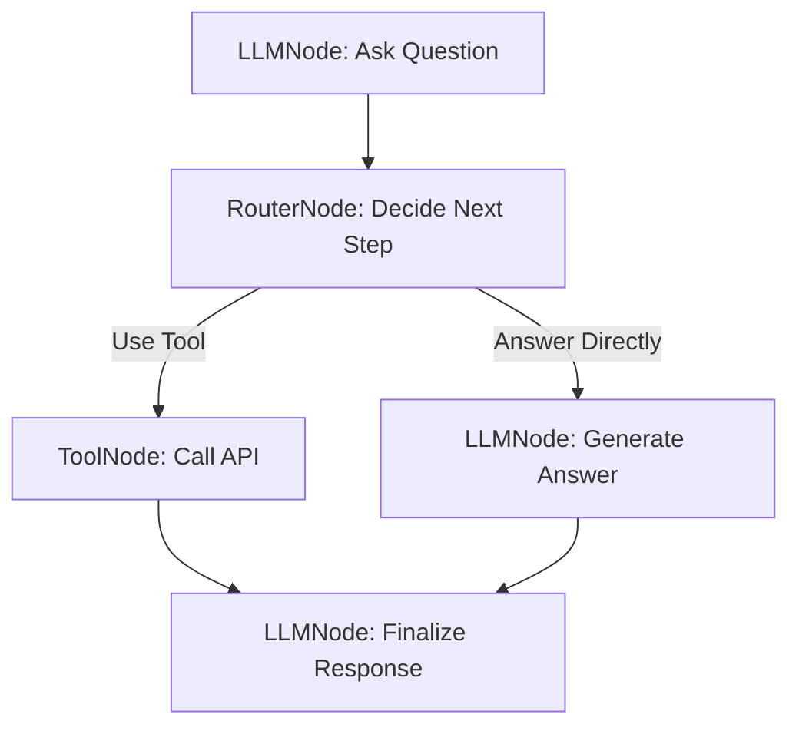

# Lár

**Lár** (Irish for "core" or "center") is a "define-by-run" agentic framework for building auditable and reliable AI systems.

It is engineered as a robust alternative to static, chain-based tools, which often obscure logic, inhibit debugging, and fail unpredictably. Lár implements a "glass box" architecture, inspired by the dynamic graphs of PyTorch, where every step of an agent's reasoning process is explicit, inspectable, and testable.

This framework provides a deterministic, stateful, and node-based system for orchestrating complex agentic behavior, including self-correction, dynamic branching, and tool-use loops.

---

## Core Philosophy: "Glass Box" vs. "Black Box"

The primary challenge in production-grade AI is a lack of traceability. When a multi-step agent fails, it's often impossible to determine *why*.

- **The "Black Box" (Chain-based):** Logic is defined in a single, monolithic chain. The entire sequence is executed at once. State is implicit, and debugging is limited to `print()` statements and guesswork.

- **The "Glass Box" (Lár):** Logic is encapsulated in discrete **Nodes** (`LLMNode`, `ToolNode`, `RouterNode`). An **Executor** runs one node at a time. After every step, the system's complete **State** is logged and inspected.

This "define-by-run" approach transforms debugging from an art into a science. You can visually trace execution, inspect the *diff* of the state at every transition, and pinpoint the exact node where logic failed.

---

## Key Features

- **Define-by-Run Architecture:** The execution graph is created dynamically, step-by-step. This naturally enables complex, stateful logic like loops and self-correction.
- **Total Auditability:** The `GraphExecutor` produces a complete, step-by-step history of every node executed, the state *before* the run, and the state *after*.
- **Deterministic Logic:** Replace "prompt-chaining" with explicit, testable Python code. Use the `RouterNode` for clear, auditable branching instead of relying on an LLM to guess the next step.
- **Testable Units:** Every node is a standalone class. You can unit test your `ToolNode` (your "hands") and your `RouterNode` (your "logic") completely independently of an LLM call.
- **`Lár.ai AgentScope`:** A built-in Streamlit visualizer (`visualizer_app.py`) that provides a live, step-by-step debugger for your agents.

---

## Installation

This project is managed with [Poetry](https://python-poetry.org/).

1. **Clone the repository:**

   ```bash
   git clone https://github.com/YOUR_USERNAME/lar.git
   cd lar
   ```

2. **Install dependencies:**

   This command creates a virtual environment and installs all packages from `pyproject.toml`.

   ```bash
   poetry install
   ```

3. **Activate the virtual environment:**

   ```bash
   poetry shell
   ```

---

## Quick Start

Create a simple agent that asks a question and uses a tool to answer it:

```python
from lar import LLMNode, ToolNode, GraphExecutor

class EchoTool(ToolNode):
    def run(self, input_text):
        return f"Echo: {input_text}"

llm_node = LLMNode(prompt="What is your question?")
tool_node = EchoTool()

executor = GraphExecutor(start_node=llm_node)
executor.add_node(tool_node)

result = executor.run()
print(result)
```

---

## Architecture Overview

Lár's architecture is composed of:

- **Nodes:** Basic units of computation or decision.
  - `LLMNode`: Interfaces with language models.
  - `ToolNode`: Wraps external tools or APIs.
  - `RouterNode`: Implements branching logic.
- **Executor:** Runs nodes one at a time, maintaining explicit state.
- **State:** A snapshot of all variables and outputs at each step.
- **Graph:** The dynamic structure of nodes connected by edges.

---

## Example: Agent Flow Diagram



---

## Project Vision

Lár aims to empower developers to build AI systems that are:

- **Transparent:** Every step is visible and understandable.
- **Reliable:** Errors can be detected and corrected dynamically.
- **Flexible:** Easily extendable with new nodes and tools.
- **Testable:** Units can be verified independently.
- **Auditable:** Complete execution history for compliance and debugging.

---

## Contributing

Contributions are welcome! Please follow these steps:

1. Fork the repository.
2. Create a new branch for your feature or bugfix.
3. Write tests for your changes.
4. Submit a pull request with a clear description.

Please adhere to the code style and write clear commit messages.

---

## License

This project is licensed under the MIT License. See the [LICENSE](LICENSE) file for details.