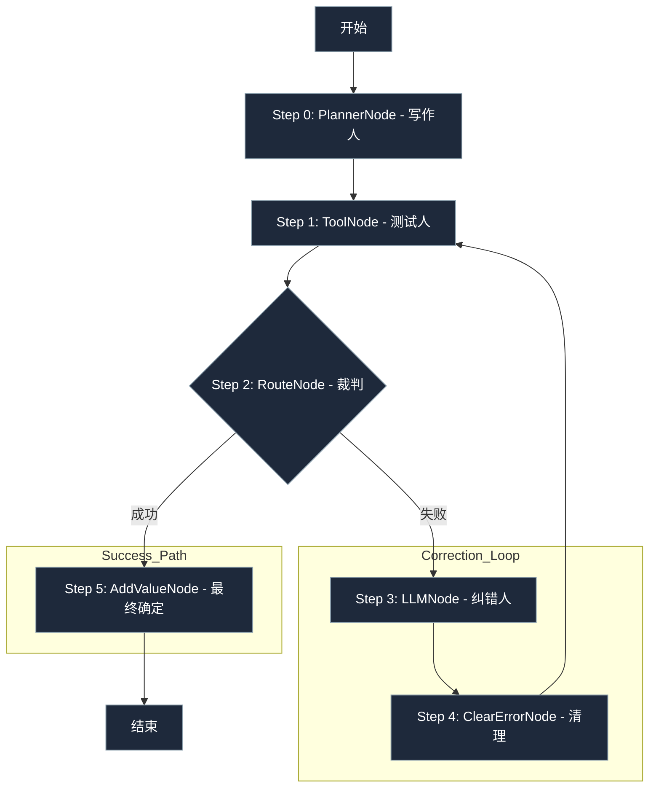
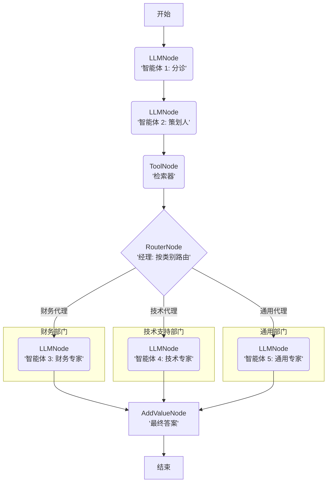

<p align="center">
  
</p>
<p align="center"><em>Lár: 智能体领域的 PyTorch</em></p>
<p align="center">
  <a href="https://pypi.org/project/lar-engine/">
    
  </a>
  <a href="https://pypi.org/project/lar-engine/">
    
  </a>
  <a href="https://github.com/sponsors/axdithyaxo">
    
  </a>
</p>

# Lár: 智能体领域的 PyTorch


**Lár**（爱尔兰语中意为“核心”或“中心”）是为构建**确定性、可审计且具备离线隔离能力**的 AI 智能体而设计的开源标准。

它是一个**“运行即定义”**的框架，充当智能体的**飞行记录仪**，为每一步操作创建完整的审计轨迹。

> [!NOTE]
> **Lár 不是一个封装库（Wrapper）。**
> 它是一个从零开始设计的独立引擎，专注于可靠性。它不封装 LangChain、OpenAI Swarm 或任何其他库。它是纯粹的、低依赖的 Python 代码，专为“代码即图”（Code-as-Graph）执行而优化。

## “黑盒”难题

你作为开发人员启动了一个**关键任务 AI 智能体**。它在你的机器上运行正常，但在生产环境中却失败了。
你不知道原因**为何**，发生在**何处**，或者消耗了**多少成本**。你得到的只是魔术般的框架抛出的 100 行堆栈跟踪。

## “玻璃盒”方案

**Lár 移除了魔法。**

它是一个简单的引擎，**每次运行一个节点**，并将每一步记录到取证级的**飞行记录仪**中。

这意味着你可以获得：
1.  **即时调试**：查看导致崩溃的确切节点和错误。
2.  **免费审计**：内置每项决策和 Token 成本的完整历史记录。
3.  **全面控制**：构建确定性的“生产流水线”，而非混乱的聊天室。

> *“这证明了对于没有随机性或外部模型可变性的图，Lár 的执行是确定性的，并能产生完全一致的状态轨迹。”*

*停止猜测。开始构建你可信赖的智能体。*


## 为什么 Lár 更好： “玻璃盒”优势

| 特性 | “黑盒” (LangChain / CrewAI) | “玻璃盒” (Lár) |
| :--- | :--- | :--- |
| **调试** | **一场噩梦。** 当智能体失败时，你会从框架内部的“魔法”执行器中得到 100 行堆栈跟踪。你必须猜测哪里出了问题。 | **即时且精确。** 历史日志就是调试器。你可以看到失败的确切节点（例如 `ToolNode`）、确切的错误（`APIConnectionError`）以及导致错误的确切状态。 |
| **可审计性** | **外部且付费。** “发生了什么？”是一个谜。你需要 LangSmith 等外部付费工具来为你的“黑盒”添加“飞行记录仪”。 | **内置且免费。** **“飞行日志”**（历史日志）是 `GraphExecutor` 的核心默认输出。你从第一天起就拥有它。 |
| **多智能体协作** | **混乱的“聊天室”。** 智能体被放在一个房间里互相“交谈”。这很神奇，但也无法控制。你无法确定谁会下一个发言，或者它们是否会陷入死循环。 | **确定性的“生产流水线”。** 你是架构师。你使用 `RouterNode` 和 `ToolNode` 定义确切的协作路径。 |
| **确定性控制** | **无。** 你无法保证执行顺序。“推特（Tweeter）”智能体可能会在“研究（Researcher）”智能体完成前运行。 | **全面控制。** 在“RAG 助手”（`ToolNode`）成功完成并将结果保存到状态之前，“推特助手”（`LLMNode`）无法运行。 |
| **数据流** | **隐式且凌乱。** 智能体通过“聊天”传递数据。`ToolNode` 的输出可能会被另一个智能体的“想法”所污染。 | **显式且硬编码。** 数据流由你定义：`RAG 输出 -> 推特输入`。推特助手只能看到它应该看到的数据。 |
| **弹性与成本** | **浪费且脆弱。** 如果 RAG 智能体失败，推特智能体可能仍会在无数据的情况下运行，白白浪费 API 调用和资金。5 个智能体不断聊天的循环会很快触发频率限制。 | **高效且稳健。** 如果 RAG 智能体失败，推特助手永远不会运行。你的图会停止，为你节省资金并防止出现错误输出。`LLMNode` 内置的重试机制可静默处理瞬时错误。 |
| **核心哲学** | 兜售“魔法”。 | 兜售“信任”。 |

---

## 全球模型支持： 由 LiteLLM 驱动

**Lár 支持 100 多家供应商。**
因为 Lár 构建在强大的 **[LiteLLM](https://docs.litellm.ai/docs/)** 适配器之上，你不会被链接到单一供应商。

从 **OpenAI** 开始原型设计。部署到 **Azure/Bedrock** 以满足合规性。切换到 **Ollama** 以实现本地私密。所有这些都只需**零重构**。

| **任务** | **LangChain / CrewAI** | **Lár (统一方式)** |
| :--- | :--- | :--- |
| **切换供应商** | 1. 导入新的供应商类。<br>2. 实例化特定对象。<br>3. 重构逻辑。 | **更改 1 个字符串。**<br>`model="gpt-4o"` → `model="ollama/phi4"` |
| **代码更改** | **显著。** 需要更改 `ChatOpenAI` 或 `ChatBedrock` 类。 | **零。** 每个模型的 API 契约完全一致。 |

**[阅读完整的 LiteLLM 设置指南](https://docs.snath.ai/guides/litellm_setup/)** 了解如何配置：
-   **本地模型** (Ollama, Llama.cpp, LocalAI)
-   **云端供应商** (OpenAI, Anthropic, Vertex, Bedrock, Azure)
-   **高级配置** (Temperature, API Base, 自定义请求头)

```python
# 想省钱？切换到本地模型。
# 无需更改导入。无需重构逻辑。

# 之前 (云端)
node = LLMNode(model_name="gpt-4o", ...)

# 之后 (本地 - Ollama)
node = LLMNode(model_name="ollama/phi4", ...)

# 之后 (本地 - 通用服务器)
node = LLMNode(
    model_name="openai/custom",
    generation_config={"api_base": "http://localhost:8080/v1"}
)
```

---

## 快速上手 (`v1.4.0`)

**构建智能体最快的方式是使用 CLI。**

### 1. 安装与脚手架
```bash
pip install lar-engine
lar new agent my-bot
cd my-bot
poetry install  # 或 pip install -e .
python agent.py
```
> 这将生成一个包含 `pyproject.toml`、`.env` 和模板智能体的生产级文件夹结构。
> *(适用于 Lár v1.4.0+)*

### 2. “低代码”方式 (`@node`)
将节点定义为简单的函数，无需模板代码。
```python
from lar import node

@node(output_key="summary")
def summarize_text(state):
    # 像字典一样访问状态 (v1.4.0 新特性!)
    text = state["text"] 
    return llm.generate(text)
```
*(参见 `examples/v1_4_showcase.py` 获取详细对比)*

## 变革性特性： 混合认知架构

**大多数框架都是“全 LLM”的。这无法扩展。**
如果每一步都要花费 $0.05 且耗时 3 秒，你无法运行 1,000 个智能体。

### 1. “建筑工地”比喻

*   **旧方法 (标准智能体):**
    想象一个建筑工地，**每个工人都是高薪建筑师**。为了钉一颗钉子，他们会停下来，“思考”这颗钉子，写一首关于钉子的诗，然后收你 5 美元。这耗费时间且代价高昂。

*   **Lár 的方法 (混合集群):**
    想象 **1 名建筑师** 和 **1,000 个机器人**。
    1.  **建筑师 (编排节点)**：看一次蓝图。大喊：*“盖摩天大楼！”*
    2.  **机器人 (集群)**：它们听到指令。它们不“思考”。它们不收 5 美元。它们只是瞬间完成数千个**执行**步骤。

### 2. 数据胜于雄辩

我们在 **[`examples/scale/1_corporate_swarm.py`](examples/scale/1_corporate_swarm.py)** 中证明了这一点。

| 特性 | 标准“智能体构建器” (LangChain/CrewAI) | Lár “混合” 架构 |
| :--- | :--- | :--- |
| **逻辑** | 100% LLM 节点。每一步都是提示词。 | **1% LLM (编排) + 99% 代码 (集群)** |
| **成本** | **$$$** (60 次 LLM 调用)。 | **$** (1 次 LLM 调用)。 |
| **速度** | **慢** (60秒+ 延迟)。 | **瞬间** (64 个步骤仅需 0.08秒)。 |
| **可靠性** | **低**。受“传声筒”效应影响。 | **高**。确定性执行。 |

### 3. 案例研究： “确凿证据”

我们在大规模 LangChain/LangGraph 中构建了通用的“企业集群”进行对比 (`examples/comparisons/langchain_swarm_fail.py`)。
**它在第 25 步崩溃了。**

```text
-> Step 24
确认崩溃：达到 25 步的递归限制，未命中停止条件。
LangGraph 引擎因递归限制停止执行。
```

**为什么这很重要：**
1.  **“递归限制”崩溃**：标准执行器将智能体视为循环。它们上限为 25 步以防止死循环。实际工作（如 60 步的集群）会触发此安全开关。
2.  **复用模式**：你不需要框架，你需要模式。我们提供了 **21 个单文件配方** (Examples 1-21)。
3.  **“Token 燃烧”**：标准框架使用 LLM 进行每一步路由（每轮约 $0.60）。Lár 使用代码实现（每轮 $0.00）。
4.  **“传声筒游戏”**：数据经过 60 层 LLM 会导致上下文损坏。Lár 传递显式的状态对象。

> “Lár 将智能体从‘聊天机器人原型’转变为‘高性能软件’。”

---


### 一个简单的自我纠错循环



---


## `Lár` 架构： 核心原语

你可以使用四个核心组件构建任何智能体：

1.  **`GraphState`**：一个简单、统一的对象，持有智能体的“记忆”。它被传递给每个节点，允许一个节点写入数据（`state.set(...)`）而下一个节点读取它（`state.get(...)`）。

2.  **`BaseNode`**：所有可执行单元的抽象类（即“契约”）。它强制执行一个方法：`execute(self, state)`。`execute` 方法的唯一职责是执行其逻辑并返回*下一个*运行的 `BaseNode`，或者返回 `None` 以终止图。

3.  **`GraphExecutor`**：运行图的“引擎”。它是一个 Python 生成器，运行一个节点，产生该步骤的执行日志，然后暂停，等待下一次调用。
    
    **v1.3.0 新特性：** 模块化观测：
    - **`AuditLogger`**：集中管理审计轨迹日志和文件持久化（符合 GxP 标准）
    - **`TokenTracker`**：汇总跨多个平台和模型的 Token 使用情况
    
    ```python
    # 默认 (自动 - 推荐)
    executor = GraphExecutor(log_dir="my_logs")
    
    # 高级 (通过自定义注入实现跨工作流的成本聚合)
    from lar import AuditLogger, TokenTracker
    custom_tracker = TokenTracker()
    executor1 = GraphExecutor(logger=AuditLogger("logs1"), tracker=custom_tracker)
    executor2 = GraphExecutor(logger=AuditLogger("logs2"), tracker=custom_tracker)
    # 两个执行器共享同一个 tracker → 实现汇总成本追踪
    ```
    
    **参见：** `examples/patterns/16_custom_logger_tracker.py` 获取完整演示

### 4. v1.7+ 中的节点实现 (积木块)

Lár 的执行本质上就是将 `GraphState` 对象从一个节点传递到下一个节点。以下是 v1.7+ 中提供的核心节点及其用法。

#### 1. 大脑： `LLMNode`
`LLMNode` 是生成式 AI 的所在地。它从状态中读取数据，生成响应，记录加密 Token，并将输出保存回状态。
* **工作原理：** 底层使用 LiteLLM，这意味着你可以毫不费力地接入 OpenAI、Anthropic 或 Gemini。关键是，它会自动强制执行你的 `token_budget`（Token 预算），如果超限则停止运行。
```python
from lar import LLMNode
translator_node = LLMNode(
    model_name="gpt-4o",
    system_instruction="你是一位专业的翻译员。",
    prompt_template="将这段文字翻译成法语：{english_text}",
    output_key="french_translation"
)
```

#### 2. 交通指挥： `RouterNode`
有时 AI 需要做出决定。`RouterNode` 评估状态并将流程导向不同的分支。
* **工作原理：** 你提供一个返回字符串的 Python `decision_function`。路由节点将该字符串匹配到 `path_map`，并将状态推送到正确的分支。

#### 3. 各种工具： `ToolNode`
要发送邮件、查询数据库或执行 API，请使用 `ToolNode`。
* **工作原理：** 你将标准的 Python 函数封装在 `ToolNode` 中。节点从 `GraphState` 中获取参数，运行脚本，并将结果全局保存。

#### 4. 扩展性： `BatchNode` (v1.5+)
`BatchNode` 允许同时并行执行一整个节点列表。
* **工作原理：** 它启动并行线程，为每个线程提供完美的 `GraphState` 隔离克隆，运行节点，并干净地合并结果。

#### 5. 记忆管理器： `ReduceNode` (v1.6+)
`ReduceNode` 通过显式的记忆压缩防止上下文膨胀。
* **工作原理：** 它类似于 `LLMNode`，但在生成摘要后，它像垃圾回收器一样从状态中彻底**删除**原始且臃肿的数据键。

#### 6. 架构师： `DynamicNode` (v1.5+)
`DynamicNode` 允许在运行时递归生成图。
* **工作原理：** 该节点递归地生成子智能体，实现“分形代理（Fractal Agency）”策略，根据自身进度动态构建新的路由层。

#### 7. 监管合规： `HumanJuryNode`
对于高风险环境，欧盟 AI 法案第 14 条要求“人工介入（Human-in-the-Loop）”监督。
* **工作原理：** 此节点暂停整个图的执行，在 CLI 上安全地显示上下文，并等待显式的人工按键来批准或拒绝操作。

#### 8. 快车道： `@node` 装饰器
`@node` 装饰器允许你立即将 Python 函数转换为 Lár 节点。
* **工作原理：** 只需给函数打上 `@node` 标签。该函数将 `state` 作为参数，返回的任何内容都会分配给 `output_key`。
```python
from lar import node

@node(output_key="formatted_date", next_node=llm_node)
def fix_date(state):
    return state.get("raw_date").replace("-", "/")
```

---

## 推理模型 (System 2 支持)

**Lár 将“思考（Thinking）”视为一等公民。**
原生支持 **DeepSeek R1**、**OpenAI o1** 和 **Liquid**。

- **审计逻辑**：独特的 `<think>` 标签被记录在元数据中，保持主上下文窗口整洁。
- **鲁棒性**：自动处理标签畸形和后备逻辑。
- **示例**：`examples/reasoning_models/1_deepseek_r1.py`

## 为什么选择 Lár？
- **经济约束**：保证智能体在执行前不会超过数学上设定的 Token 预算。(v1.6+)
- **记忆压缩**：通过 `ReduceNode` Map-Reduce 模式显式从状态中删除上下文，防止“黑洞”级的 Token 膨胀。(v1.6+)
- **分形代理**：智能体可以递归生成子智能体 (`DynamicNode`)。(v1.5+)
- **真正并行**：在并行线程中运行多个智能体 (`BatchNode`)。(v1.5+)
- **轻量级**：不需要向量数据库。只需 Python。
- **模型无关**：支持 OpenAI, Gemini, Claude, DeepSeek, Ollama 等。
- **玻璃盒**：每一步、每个提示词和想法都记录到 `lar_logs/` 以供审计。
- **自动获取**：“思考过程”被提取并保存到 `run_metadata` 中。
- **整洁输出**：下游节点只能看到最终答案。
- **稳健性**：同时支持基于 API 的推理（o1）和本地原生推理（通过 Ollama 的 DeepSeek R1）。

```python
# examples/reasoning_models/1_deepseek_r1.py
node = LLMNode(
    model_name="ollama/deepseek-r1:7b",
    prompt_template="请解决：{puzzle}",
    output_key="answer"
)
# 结果: 
# state['answer'] = "答案是 42。"
# log['metadata']['reasoning_content'] = "<think>首先，我计算...</think>"
```

---

## “玻璃盒”审计轨迹示例

你不需要猜测智能体为什么失败。`lar` 是一个“玻璃盒”，为每次运行（尤其是失败的运行）提供完整且可审计的日志。

这是一个来自基于 lar 构建的智能体的**真实执行**日志。该智能体的工作是运行“策划人”和“合成人”（均为 LLMNode）。GraphExecutor 捕获到了一个致命错误，优雅地停止了智能体，并生成了这份完美的审计轨迹。

**执行摘要 (运行 ID: a1b2c3d4-...)**
| 步骤 | 节点 | 结果 | 关键变更 |
| :--- | :--- | :--- | :--- |
| 0 | `LLMNode` | `success` | `+ 新增: 'search_query'` |
| 1 | `ToolNode` | `success` | `+ 新增: 'retrieved_context'` |
| 2 | `LLMNode` | `success` | `+ 新增: 'draft_answer'` |
| 3 | `LLMNode` | **`error`** | **`+ 新增: 'error': "APIConnectionError"`** |

**这就是 `lar` 的不同之处。** 你知道确切的节点（`LLMNode`）、确切的步骤（3）以及失败的确切原因（`APIConnectionError`）。你无法调试“黑盒”，但你**永远可以**修复“玻璃盒”。

---

## 加密审计日志 (v1.5.1+)

对于企业环境（欧盟 AI 法案、SOC2、HIPAA），仅有日志是不够的——你必须证明日志未被篡改。

Lár 原生支持对审计日志进行 **HMAC-SHA256 加密签名**。如果智能体执行一笔高额交易或医疗诊断，`GraphExecutor` 将使用密钥对整个执行轨迹（包括访问过的节点、LLM 推理和 Token 使用量）进行数学签名。

```python
from lar import GraphExecutor

# 1. 实例化带有 HMAC 密钥的执行器，开启加密审计
executor = GraphExecutor(
    log_dir="secure_logs", 
    hmac_secret="your_enterprise_secret_key"
)
# 2. 正常运行智能体。生成的 JSON 日志将包含一个 SHA-256 签名。

# 3. 稍后要验证审计日志，可以使用独立验证脚本：
# 参见：examples/compliance/11_verify_audit_log.py
```

### 如何验证 (供审计员使用)
我们提供了一个独立的验证脚本，专门供合规官数学地证明日志未被篡改。

**第 1 步：** 找到生成的 JSON 审计日志 (如 `secure_logs/run_xyz.json`)。
**第 2 步：** 获取智能体执行期间使用的企业 HMAC 密钥。
**第 3 步：** 在终端运行验证脚本：
```bash
python examples/compliance/11_verify_audit_log.py secure_logs/run_xyz.json your_enterprise_secret_key
```

**结果：** 脚本将输出 `[+] VERIFICATION SUCCESSFUL`（真实有效）或 `[-] VERIFICATION FAILED`（已被篡改）。

**参见合规模式库获取完整的验证脚本：**
*   [`examples/compliance/8_hmac_audit_log.py`](examples/compliance/8_hmac_audit_log.py) (基础认证)
*   [`examples/compliance/9_high_risk_trading_hmac.py`](examples/compliance/9_high_risk_trading_hmac.py) (算法交易 / SEC)
*   [`examples/compliance/10_pharma_clinical_trials_hmac.py`](examples/compliance/10_pharma_clinical_trials_hmac.py) (FDA 21 CFR Part 11)
*   [`examples/compliance/11_verify_audit_log.py`](examples/compliance/11_verify_audit_log.py) (独立审计脚本)


##  即时集成 (Just-in-Time Integrations)

**不再等待“HubSpot 支持”合并请求。**

Lár 不附带 500 多个脆弱的 API 封装器。相反，我们提供 **集成构建器 (Integration Builder)**。

1.  将 [`IDE_INTEGRATION_PROMPT.md`](IDE_INTEGRATION_PROMPT.md) **拖入** 你的 AI 聊天窗口 (Cursor/Windsurf)。
2.  **提问**：*“帮我做一个查询 Stripe API 失败付款的工具。”*
3.  **搞定**：你在 30 秒内获得了一个生产级、类型安全的 `ToolNode`。

 **[阅读完整指南](https://docs.snath.ai/guides/integrations/)** | **[查看示例](examples/patterns/7_integration_test.py)**


## 元认知 (Level 4 Agency)

**v1.3 新特性**：Lár 引入了**动态图**，允许智能体在运行时重写自己的拓扑结构。

这解锁了以往在静态有向无环图 (DAG) 中无法实现的能力：
- **自我修复**：检测错误并注入恢复子图。
- **工具发明**：动态编写并执行自己的 Python 工具。
- **自适应深度**：决定是选择“快速回答”（1个节点）还是“深入研究”（N个节点）。
- **自定义观测**：注入自定义 logger/tracker 实例，用于高级成本追踪和审计轨迹管理 (`examples/patterns/16_custom_logger_tracker.py`)。

> [!IMPORTANT]
> **风险缓解**：自修改代码本质上是有风险的。Lár 通过以下方式确保**合规性**：
> 1. 记录生成的图的确切 JSON (审计轨迹)。
> 2. 使用确定性的 `TopologyValidator` (非 AI) 防止未经授权的工具、死循环或**畸形的图结构** (结构完整性)。

参见 `examples/metacognition/` 获取 5 个可运行的概念验证。

---

## 分形代理 (v1.5+)

**无限制地扩展。**

使用 `DynamicNode` 和 `BatchNode`，Lár 图可以显式生成自身的递归副本，或动态启动全新的嵌套图拓扑。

- **递归子智能体：** 一个智能体可以停止推理，定义一个新的专门化图，并在恢复原线程之前将其作为子进程执行。
- **深度研究树：** 允许智能体根据数据复杂性动态分支并执行并行深入研究。
- **完美隔离：** 每个生成的图都在自己的内存空间中运行，确保不会对父级产生上下文干扰——仅返回最终合成的答案。

**[阅读概念指南全文](https://docs.snath.ai/core-concepts/11-fractal-agency)** | **[查看高级演示](examples/advanced/fractal_polymath.py)**

---

## DMN 演示： 一种认知架构

**[snath-ai/DMN](https://github.com/snath-ai/DMN)** —— 展示 Lár 能力的旗舰演示。

DMN (默认模式网络) 是完全构建在 Lár 之上的**完整认知架构**，展示了当结合以下特性时可以实现的可能性：
- **两院制思想 (Bicameral Mind)**：并行的快/慢思考系统
- **睡眠周期**：在“休息”期间自动合并记忆
- **情景记忆**：具有矢量化召回功能的长期存储
- **自我意识**：元认知的自我省察和自适应行为

> [!NOTE]
> **DMN 证明了 Lár 不仅仅是为了聊天机器人。** 它是一个构建真正智能系统的平台，具有记忆、学习和自我改进能力。

### DMN 有何特别之处？

| 特性 | 传统智能体 | DMN (基于 Lár) |
|---------|-------------------|---------------------|
| **记忆** | 仅限于上下文窗口 | 带有睡眠合并功能的持久情景记忆 |
| **学习** | 静态提示词 | 从交互中学习并自我纠正 |
| **架构** | 单路径逻辑 | 双过程 (快 + 慢) 认知系统 |

### 解决灾难性遗忘

标准的 LLM 智能体受困于**智能体级别的灾难性遗忘**：一旦上下文窗口填满，旧消息就会被静默截断，智能体将永久丢失过去交互的所有知识。与任何聊天机器人聊两个小时，它就会忘记第一个小时的内容。

DMN 从**架构上**解决了这个问题，无需重新训练或修改模型参数：

1.  **合并，而非积累**。Dreamer 将原始交互日志在空闲期合成为密集的语义叙述。保留意义；丢弃原始 Token。
2.  **分层检索**。热点记忆提供即时的对话流。温/冷记忆提供深度的长期召回——通过前额叶皮层路由，因此只有压缩后的相关上下文会进入提示词。
3.  **无限跨度**。由于记忆永久存储在 ChromaDB 中并按需检索，智能体可以无限期运行，永远不会触及上下文窗口限制。

#### 人类类比

这不是一种新奇的策略，而是生物大脑的实际运作方式。

人类大脑不会每晚重写神经网络权重。相反，**海马体**在睡眠期间将当天的经历整合到长期皮层存储中。你不会记得早上通勤的每个像素，但你会记得下雨了且交通很差。原始感官数据消失了，但*意义*持久存在。

DMN 将这种精确的生物策略实现为软件架构：

| 人类大脑 | Lár DMN |
|---|---|
| 感官输入 | 用户消息 (原始日志) |
| 海马体合并 (睡眠) | Dreamer 守护进程 (空闲触发) |
| 长期皮层存储 | ChromaDB (温 + 冷分层) |
| 前额叶过滤 (注意力) | PrefrontalNode (压缩网关) |
| 工作记忆 | 热点记忆 (最后 5 轮) |

> [!IMPORTANT]
> **关键洞察：** 研究人员花费数十亿美元试图通过连续学习在模型权重层面解决灾难性遗忘。DMN 采用了不同的方法：*不要修理大脑——构建一个外部海马体。* 基础模型保持冻结。记忆是架构问题，而非训练问题。

**[阅读 DMN 概念指南全文](https://docs.snath.ai/core-concepts/12-catastrophic-forgetting)** | **[探索 DMN 仓库 →](https://github.com/snath-ai/DMN)**

---

## 后 LLM 编排： Lar-JEPA

**[snath-ai/Lar-JEPA](https://github.com/snath-ai/Lar-JEPA)** —— 一个专门用于路由**预测世界模型 (Predictive World Models)** 的测试平台。

随着 AI 从纯粹的自动回归文本生成转向联合嵌入预测架构 (JEPAs)，框架必须做出调整。**Lar-JEPA** 是一个概念验证仓库，展示了 Lár 的确定性执行脊柱如何使用 System 2 `RouterNodes` 安全地路由海量的抽象数学状态 (张量/嵌入)，而不依赖于 LLM 聊天生成。

**[探索 DMN 仓库 →](https://github.com/snath-ai/DMN)**

---


## 安装

本项目由 [Poetry](https://python-poetry.org/) 管理。

1.  **克隆仓库：**

    ```bash
    git clone https://github.com/snath-ai/lar.git
    cd lar
    ```

2. **设置环境变量**
Lár 底层使用统一的 LiteLLM 适配器。这意味着如果模型受 LiteLLM 支持（包括 Azure、Bedrock、VertexAI 在内的 100 多个供应商），它就受 Lár 支持。

创建 `.env` 文件：

```bash
# 运行 Gemini 模型所需：
GEMINI_API_KEY="您的_GEMINI_KEY" 
# 运行 OpenAI 模型所需 (例如 gpt-4o)：
OPENAI_API_KEY="您的_OPENAI_KEY"
# 运行 Anthropic 模型所需 (例如 Claude)：
ANTHROPIC_API_KEY="您的_ANTHROPIC_KEY"
```

3.  **安装依赖：**
    此命令会创建虚拟环境并安装 `pyproject.toml` 中的所有包。

    ```bash
    poetry install
    ```


---

## 准备好使用 Lár 构建了吗？ (智能体 IDE)

Lár 专为 **智能体 IDE (Agentic IDEs)**（如 Cursor, Windsurf, Antigravity）和严格的代码生成而设计。

我们在仓库中提供了一个 **3 步工作流**，直接让你的 IDE 成为专家级的 Lár 架构师。

### 1. 策略：“引用，而非复制”
不要粘贴大量的提示词，只需**引用** `lar/` 目录中的主文件。

### 2. 工作流
1.  **上下文 (大脑)**：在 IDE 聊天中，引用 `@lar/IDE_MASTER_PROMPT.md`。这会加载严格的类型规则和“代码即图”哲学。
2.  **集成 (手)**：引用 `@lar/IDE_INTEGRATION_PROMPT.md`，在几秒钟内生成生产级的 API 封装器。
3.  **脚手架 (需求)**：打开 `@lar/IDE_PROMPT_TEMPLATE.md`，填写你的智能体目标，并请求 IDE “实现它”。

**发给 Cursor/Windsurf 的示例提示词：**
> "根据 @lar/IDE_MASTER_PROMPT.md 中的规则，实现 @lar/IDE_PROMPT_TEMPLATE.md 中描述的智能体。"

### 3. 通过示例学习

我们在 **[`examples/`](examples/)** 目录中提供了 **21 个核心模式**，按类别组织：

> **[查看视觉库](https://snath.ai/examples)**：在我们的网站上浏览带有图表和用例的所有模式。

#### 1. 基础原语 (`examples/basic/`)
| # | 模式 | 概念 |
| :---: | :--- | :--- |
| **1** | **[`1_simple_triage.py`](examples/basic/1_simple_triage.py)** | 分类与线性路由 |
| **2** | **[`2_reward_code_agent.py`](examples/basic/2_reward_code_agent.py)** | 代码优先的智能体逻辑 |
| **3** | **[`3_support_helper_agent.py`](examples/basic/3_support_helper_agent.py)** | 轻量级工具助手 |
| **4** | **[`4_fastapi_server.py`](examples/basic/4_fastapi_server.py)** | FastAPI 封装 (随处部署) |

#### 2. 核心模式 (`examples/patterns/`)
| # | 模式 | 概念 |
| :---: | :--- | :--- |
| **1** | **[`1_rag_researcher.py`](examples/patterns/1_rag_researcher.py)** | RAG (ToolNode) 与状态合并 |
| **2** | **[`2_self_correction.py`](examples/patterns/2_self_correction.py)** | “裁判”模式与错误循环 |
| **3** | **[`3_parallel_execution.py`](examples/patterns/3_parallel_execution.py)** | 扇出 / 扇入聚合 |
| **4** | **[`4_structured_output.py`](examples/patterns/4_structured_output.py)** | 严格的 JSON 强制执行 |
| **5** | **[`5_multi_agent_handoff.py`](examples/patterns/5_multi_agent_handoff.py)** | 多智能体协作 |
| **6** | **[`6_meta_prompt_optimizer.py`](examples/patterns/6_meta_prompt_optimizer.py)** | 自修改智能体 (元推理) |
| **7** | **[`7_integration_test.py`](examples/patterns/7_integration_test.py)** | 集成构建器 (CoinCap) |
| **8** | **[`8_ab_tester.py`](examples/patterns/8_ab_tester.py)** | A/B 测试 (并行提示词) |
| **9** | **[`9_resumable_graph.py`](examples/patterns/9_resumable_graph.py)** | 时间旅行者 (崩溃并恢复) |
| **10** | **[`16_custom_logger_tracker.py`](examples/patterns/16_custom_logger_tracker.py)** | 高级观测能力 |

#### 3. 推理器与对比 (`examples/reasoning_models/`, `examples/comparisons/`)
| # | 模式 | 概念 |
| :---: | :--- | :--- |
| **1** | **[`1_deepseek_r1.py`](examples/reasoning_models/1_deepseek_r1.py)** | 原生 `<think>` 标签解析 |
| **2** | **[`2_openai_o1.py`](examples/reasoning_models/2_openai_o1.py)** | 高 IQ O1 策划节点 |
| **3** | **[`3_liquid_thinking.py`](examples/reasoning_models/3_liquid_thinking.py)** | 快速本地边缘推理 |
| **4** | **[`langchain_swarm_fail.py`](examples/comparisons/langchain_swarm_fail.py)** | 上下文崩溃证明 |

#### 4. 合规与安全 (`examples/compliance/`)
| # | 模式 | 概念 |
| :---: | :--- | :--- |
| **1** | **[`1_human_in_the_loop.py`](examples/compliance/1_human_in_the_loop.py)** | 用户批准与中断 |
| **2** | **[`2_security_firewall.py`](examples/compliance/2_security_firewall.py)** | 使用代码阻断越狱攻击 |
| **3** | **[`3_juried_layer.py`](examples/compliance/3_juried_layer.py)** | 提案者 -> 陪审团 -> 内核 |
| **4** | **[`4_access_control_agent.py`](examples/compliance/4_access_control_agent.py)** | **旗舰级访问控制** |
| **5** | **[`5_context_contamination_test.py`](examples/compliance/5_context_contamination_test.py)** | 红队测试：社会工程 |
| **6** | **[`6_zombie_action_test.py`](examples/compliance/6_zombie_action_test.py)** | 红队测试：过时权限 |
| **7** | **[`7_hitl_agent.py`](examples/compliance/7_hitl_agent.py)** | 符合第 14 条的合规节点 |
| **8** | **[`8_hmac_audit_log.py`](examples/compliance/8_hmac_audit_log.py)** | 不可变的加密日志 |
| **9** | **[`9_high_risk_trading_hmac.py`](examples/compliance/9_high_risk_trading_hmac.py)** | 算法交易 (SEC) |
| **10** | **[`10_pharma_clinical_trials_hmac.py`](examples/compliance/10_pharma_clinical_trials_hmac.py)** | 符合 FDA 21 CFR Part 11 |
| **11** | **[`11_verify_audit_log.py`](examples/compliance/11_verify_audit_log.py)** | 独立审计脚本 |

#### 5. 大规模与高级模式 (`examples/scale/`, `examples/advanced/`)
| # | 模式 | 概念 |
| :---: | :--- | :--- |
| **1** | **[`1_corporate_swarm.py`](examples/scale/1_corporate_swarm.py)** | **压力测试**：60多个节点的图 |
| **2** | **[`2_mini_swarm_pruner.py`](examples/scale/2_mini_swarm_pruner.py)** | 动态图剪枝 |
| **3** | **[`3_parallel_newsroom.py`](examples/scale/3_parallel_newsroom.py)** | 真正并行 (`BatchNode`) |
| **4** | **[`4_parallel_corporate_swarm.py`](examples/scale/4_parallel_corporate_swarm.py)** | 并发分支执行 |
| **5** | **[`11_map_reduce_budget.py`](examples/advanced/11_map_reduce_budget.py)** | **记忆压缩与 Token 预算** |
| **6** | **[`fractal_polymath.py`](examples/advanced/fractal_polymath.py)** | **分形代理** (递归 + 并行) |
| **7** | **[`13_world_model_jepa.py`](examples/advanced/13_world_model_jepa.py)** | **预测世界模型** |

#### 6. 元认知 (`examples/metacognition/`)
参见 **[元认知文档](https://docs.snath.ai/core-concepts/9-metacognition)** 深入了解。

| # | 模式 | 概念 |
| :---: | :--- | :--- |
| **1** | **[`1_dynamic_depth.py`](examples/metacognition/1_dynamic_depth.py)** | **自适应复杂度** (1 vs N 节点) |
| **2** | **[`2_tool_inventor.py`](examples/metacognition/2_tool_inventor.py)** | **自我编程** (运行时编写工具) |
| **3** | **[`3_self_healing.py`](examples/metacognition/3_self_healing.py)** | **错误恢复** (注入修复子图) |
| **4** | **[`4_adaptive_deep_dive.py`](examples/metacognition/4_adaptive_deep_dive.py)** | **递归研究** (生成子智能体) |
| **5** | **[`5_expert_summoner.py`](examples/metacognition/5_expert_summoner.py)** | **动态角色实例化** |

---


## 示例：多智能体编排 (客服助手)

`lar` 的真正力量不只是循环，而是**多智能体编排**。

其他框架采用的是“混乱聊天室”模式，智能体互相*交谈*，而你只能*寄希望于*好的结果。`lar` 则是一条确定性的**“生产流水线”**。你是架构师，你构建一个“玻璃盒”图，将任务路由给专门的智能体，保证执行顺序并审计每一步。

### 1. “玻璃盒”流程图

这是我们要构建的简单而强大的“客户支持”智能体。它是一个“主智能体”，负责将任务分配给专家。



## Lár 引擎架构： 多智能体生产线

### 此应用的核心是一个多智能体编排图。`Lár` 迫使你定义生产线，以此保证结果的预测性和可审计性。

## 合规与安全 (全面支持欧盟 AI 法案 - 2026年8月)

Lár 为符合 **欧盟 AI 法案 (2026)** 和 **FDA 21 CFR Part 11** 的**高风险 AI 系统**而设计。

| 监管标准 | 要求 | Lár 的实现 |
| :--- | :--- | :--- |
| **欧盟 AI 法案 Art. 12** | **记录保存** | **状态差异记录 (State-Diff Ledger)**：自动创建包含每一步、变量变更和模型决策的、不可篡改的 JSON 日志。 |
| **欧盟 AI 法案 Art. 13** | **透明度** | **“玻璃盒”架构**：没有隐藏的提示词或“魔法”循环。每个节点都是显式代码，可供非技术评审员审计。 |
| **欧盟 AI 法案 Art. 14** | **人类监督** | **中断模式**：原生支持“人工介入”。可暂停执行、修改状态并恢复，确保人类对高风险决策的控制。 |
| **FDA 21 CFR Part 11** | **审计轨迹** | **加密确定性**：引擎设计具有确定性，确保临床验证的运行可复现。 |

---

## 快速浏览
### 1. 图流程 (执行序列)

智能体按固定的 6 步序列执行。图中虽然是在代码中“反向定义”的，但执行是正向的：

| 步骤        | 节点名称         | Lár 原语 | 动作                                                                                   | 状态输出       |
|-------------|-------------------|---------------|-------------------------------------------------------------------------------------------|--------------------|
| 0 (开始)   | triage_node       | LLMNode       | 将用户输入 (`{task}`) 进行分类 (财务, 技术等)。     | category           |
| 1           | planner_node      | LLMNode       | 将任务转换为简洁、高质量的搜索查询语句。                              | search_query       |
| 2           | retrieve_node     | ToolNode      | 执行本地 FAISS 向量搜索并检索相关上下文。                | retrieved_context  |
| 3           | specialist_router | RouterNode    | 决策点。读取分类并路由到相应的专家。     | (无变更; 仅路由) |
| 4           | billing/tech_agent| LLMNode       | 被选中的专家利用检索到的上下文合成最终答案。           | agent_answer       |
| 5 (结束)     | final_node        | AddValueNode  | 将合成的答案保存为 `final_response` 并终结图运行。                | final_response     |

### 2. 使用的架构原语

此演示依赖 Lár 核心原语运行：

- `LLMNode`：使用 5 次 (分诊, 策划, 以及 3 个专家节点)，用于所有推理和合成步骤。

- `RouterNode`：使用一次 (specialist_router)，用于确定性的 if/else 分支逻辑。

- `ToolNode`：使用一次 (retrieve_node)，用于安全地执行本地 RAG 数据库查找。

- `GraphExecutor`：运行这整个序列并生成完整审计日志的引擎。

### 这是来自 `support_app.py` 的核心逻辑。它就是一段干净、显式的 Python 脚本。

```python 
'''
====================================================================
    架构说明：反向定义图
    
    Lár 引擎采用“运行即定义”哲学。因为一个节点
    会引用下一个节点对象 (例如 next_node=planner_node)，
    所以节点必须按执行顺序的【反序】在 Python 中定义，
    以确保对象已在内存中存在。
    
    执行顺序：开始 (Triage) -> 结束 (Final)
    定义顺序：结束 (Final) -> 开始 (Triage)
====================================================================

'''
from lar import *
from lar.utils import compute_state_diff # (供执行器使用)

# 1. 为我们的路由节点定义选择逻辑
def triage_router_function(state: GraphState) -> str:
    """从状态中读取 'category' 并返回路由键。"""
    category = state.get("category", "GENERAL").strip().upper()
    
    if "BILLING" in category:
        return "BILLING_AGENT"
    elif "TECH_SUPPORT" in category:
        return "TECH_AGENT"
    else:
        return "GENERAL_AGENT"

# 2. 定义智能体的节点 (积木块)
# 我们由末端向起始端构建。

# --- 终点节点 (目的地) ---
final_node = AddValueNode(key="final_response", value="{agent_answer}", next_node=None)
critical_fail_node = AddValueNode(key="final_status", value="CRITICAL_FAILURE", next_node=None)

# --- “专家”代理 ---
billing_agent = LLMNode(
    model_name="gemini-1.5-pro",
    prompt_template="你是一位财务专家。请仅根据此上下文：{retrieved_context} 来回答问题：'{task}'",
    output_key="agent_answer",
    next_node=final_node
)
tech_agent = LLMNode(
    model_name="gemini-1.5-pro",
    prompt_template="你是一位技术支专家。请仅根据此上下文：{retrieved_context} 来回答问题：'{task}'",
    output_key="agent_answer",
    next_node=final_node
)
general_agent = LLMNode(
    model_name="gemini-1.5-pro",
    prompt_template="你是一位通用助手。请仅根据此上下文：{retrieved_context} 来回答问题：'{task}'",
    output_key="agent_answer",
    next_node=final_node
)
    
# --- “经理” (路由) ---
specialist_router = RouterNode(
    decision_function=triage_router_function,
    path_map={
        "BILLING_AGENT": billing_agent,
        "TECH_AGENT": tech_agent,
        "GENERAL_AGENT": general_agent
    },
    default_node=general_agent
)
    
# --- “检索器” (工具) ---
retrieve_node = ToolNode(
    tool_function=retrieve_relevant_chunks, # 这是我们的本地 FAISS 搜索
    input_keys=["search_query"],
    output_key="retrieved_context",
    next_node=specialist_router, 
    error_node=critical_fail_node
)
    
# --- “策划人” (LLM) ---
planner_node = LLMNode(
    model_name="gemini-1.5-pro",
    prompt_template="你是一个搜索查询机。将此任务转换为搜索语句：{task}。仅回复查询语句本身。",
    output_key="search_query",
    next_node=retrieve_node
)
    
# --- “分诊”节点 (真正的起始点) ---
triage_node = LLMNode(
    model_name="gemini-1.5-pro",
    prompt_template="你是一个分诊机器人。请对该任务分类：\"{task}\"。仅回复以下类别之一：BILLING, TECH_SUPPORT, 或 GENERAL。",
    output_key="category",
    next_node=planner_node
)

# 3. 运行智能体
executor = GraphExecutor()
initial_state = {"task": "我该如何重置密码？"}
result_log = list(executor.run_step_by_step(
    start_node=triage_node, 
    initial_state=initial_state
))

# 4. “随处部署”特性
# 将你的整个图逻辑序列化为可移植的 JSON 模式。
# 此文件可以在 git 中进行版本管理或导入 Snath Cloud。
executor.save_to_file("support_agent_v1.json")
print("智能体序列化成功，可以部署。")
'''
第 0 步的“玻璃盒”日志将显示：
"state_diff": {"added": {"category": "TECH_SUPPORT"}}

第 1 步的日志将显示：
"Routing to LLMNode" (即 tech_support_agent)
'''
```
-----

## 准备好构建真实的智能体了吗？
我们构建了两个足以证明这种“玻璃盒”模式的“杀手级演示”。你今天就可以克隆、构建并运行它们。

- **[snath-ai/DMN](https://github.com/snath-ai/DMN)**：**旗舰驱动演示。** 一个具有“两院制思想” (快/慢) 的认知架构，能够睡眠、做梦并整合长期记忆，从而解决灾难性遗忘。

- **[`examples/compliance/4_access_control_agent.py`](examples/compliance/4_access_control_agent.py)**：**企业级旗舰演示。** 一个“陪审团层”演示，结合了 LLM 推理、确定性策略和人工干预，用于实现安全的基础设施访问。

- **[snath-ai/rag-demo](https://github.com/snath-ai/rag-demo)**：一个完整的、具有自我纠错能力的 RAG 代理，使用本地向量数据库。

- **[snath-ai/customer-support-demo](https://github.com/snath-ai/customer-support-demo)**：上文描述的客户支持助手。

- **[snath-ai/code-repair-demo](https://github.com/snath-ai/code-repair-demo)**：一个自我修复的 CI/CD 助手，能在循环中编写测试、检测失败并修补自己的代码。

### 展示你的智能体是可审计的

- 如果你使用 Lár 引擎构建智能体，你就是在构建一个**可靠、可验证的系统**。请在你的项目 README 中展示下面的徽章，帮助我们传播“**玻璃盒**”的设计理念。

- 通过采用此徽章，你向用户和协作伙伴发出信号：你的智能体是为**生产可靠性和可审计性**而生的。

**为你的项目添加可审计徽章：**
[](https://docs.snath.ai)


**徽章 Markdown 代码：**

```markdown
[](https://docs.snath.ai)
```


## 准备好投入生产了吗？

Lár 被设计为作为一个标准的 Python 库进行部署。
阅读我们的 **[部署指南](https://docs.snath.ai/guides/deployment/)** 了解如何将你的图封装在 **FastAPI** 中并部署到 AWS/Heroku。

## 作者
**Lár** 由 **[Aadithya Vishnu Sajeev](https://github.com/axdithyaxo)** 创建。

## 支持本项目

Lár 是一个开源的智能体框架，旨在清晰、可调试且对开发人员友好。
如果本项目对您有所帮助，请考虑通过 GitHub Sponsors 支持其开发。

成为赞助者 → [在 GitHub 上赞助](https://github.com/sponsors/axdithyaxo)

您的支持将帮助我继续改进框架并为社区构建新工具。

## 贡献

我们欢迎对 **`Lár`** 的贡献。

开始之前，请阅读我们的 **[贡献指南](CONTRIBUTING.md)**，了解如何报告 Bug、提交 Pull Request 以及提议新特性。

## 许可证

**`Làr`** 采用 `Apache License 2.0` 许可证。

这意味着：

- 您可以自由地在个人、学术或商业项目中使用 Làr。
- 您可以修改和分发代码。
- 您必须保留 `LICENSE` 和 `NOTICE` 文件。
- 如果您分发修改后的版本，您必须记录所做的更改。

`Apache 2.0` 保护了原作者 `(Aadithya Vishnu Sajeev)`，同时鼓励广泛采用和社区协作。

对于基于 Làr 开发的开发人员：
请确保 `LICENSE` 和 `NOTICE` 文件完整保留，
以保持与 `Apache 2.0` 条款的完全法律兼容性。
