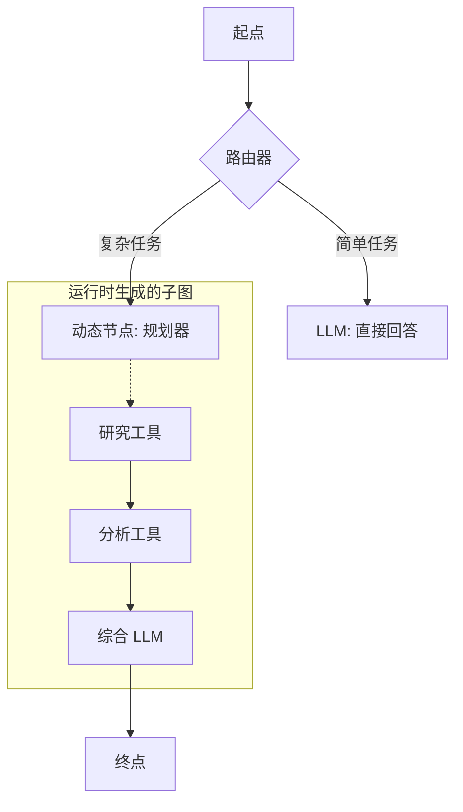

# 9. 元认知（动态图）

!!! note
    **专有特性**：此项能力需要 Lár v1.1+ 版本。它解锁了“4 级智能体”（Level 4 Agency，即主动型/自修改型智能体）。

元认知是指智能体在运行时对其自身思维过程进行**内省 (Introspect)** 并**修改**其实行结构的能力。

传统智能体遵循静态图（`A -> B -> C`）。
Lár 的元认知允许智能体说：*“这个任务对于我当前的图来说太难了。我需要生成一个研究团队，然后再回到 C 节点。”*

这是通过两个新的原语实现的：`DynamicNode` 和 `TopologyValidator`。

---

## 动态节点原语

`DynamicNode` 是一个独特的节点，它**不返回文本**。相反，它返回一个 **图规范 (Graph Spec)**（一一个关于新子图的 JSON 蓝图）。

Lár 内核会检测到此规范，暂停执行，并执行“热插拔 (Hot Swap)”：
1.  **验证 (Validate)**：根据安全规则检查新子图。
2.  **实例化 (Instantiate)**：在内存中创建新节点。
3.  **链接 (Link)**：将新子图的出口连接到原始的 `next_node`。
4.  **恢复 (Resume)**：立即执行新子图。

### 热插拔逻辑图解



---

## 安全：拓扑验证器 (Topology Validator)

允许 AI 重写其自身的代码是危险的。这就是为什么 Lár 为每一个 `DynamicNode` 都包装了一个**拓扑验证器**。

这是一个确定性的、基于代码的安全层，其强制执行以下规则：
- **循环检测**：防止死循环 (`A -> B -> A`)。
- **工具白名单**：确保生成的图只能使用预先批准列表中的功能。
- **深度限制**：防止“递归炸弹”。

如果验证器拒绝了一个图，智能体将被强制退回到一条安全路径。

---

## 5 种元认知模式

动态图解锁了强大的新能力。

### 1. 动态深度（适应性计算）
*参考示例：`examples/metacognition/1_dynamic_depth.py`*

智能体决定花费多少“脑力”。
- **用户**：“你好。” -> **智能体**：生成 1 个节点（低成本）。
- **用户**：“分析 Q4 报告。” -> **智能体**：生成 5 个并行的研究节点（高深度）。

### 2. 工具发明家（自主编程）
*参考示例：`examples/metacognition/2_tool_inventor.py`*

智能体遇到了一个没有现成工具解决的问题（例如“计算第 100 个斐波那契数”）。
- **内省**：“我没有计算器工具。”
- **行动**：它编写一个 Python 脚本，验证该脚本，并在沙箱中*执行它*。
- **结果**：它即时创建了自己的工具。

### 3. 自愈流水线
*参考示例：`examples/metacognition/3_self_healing.py`*

智能体遇到了运行时错误（例如 `数据库连接失败`）。
- **标准智能体**：崩溃报错。
- **元认知智能体**：拦截错误，生成一个“医生”子图（`检查凭据 -> 轮转密码 -> 重试`），修复环境并恢复运行。

### 4. 适应性深度研究
*参考示例：`examples/metacognition/4_adaptive_deep_dive.py`*

智能体根据查询内容更改其*整个工作流*。它不仅是路由选择，更是*架构设计*。
- **事实类**：构建一个 `搜索 -> 回答` 链。
- **观点类**：构建一个 `辩论 -> 综合` 链。

### 5. 专家召唤师（模块化代理）
*参考示例：`examples/metacognition/5_expert_summoner.py`*

智能体从磁盘加载预定义的“技能”或“子智能体”。
- **背景**：“我需要法律建议。”
- **行动**：加载 `legal_expert.json`（一个序列化后的图）并将其注入到当前的流程中。

---

## 如何使用

```python
from lar import DynamicNode, TopologyValidator

# 1. 定义安全规则
validator = TopologyValidator(allowed_tools=[my_safe_tool])

# 2. 定义元认知节点
planner = DynamicNode(
    llm_model="ollama/phi4",
    prompt_template="你是一个架构师。请输出一个 JSON 格式的图规范...",
    validator=validator,
    next_node=final_node
)
```

---

## 合规性与审计

!!! note
    **问题随之而来：“自修改代码是否违反了严格的合规性要求？”**

    在黑盒系统中，**是**。
    在 Lár 中，**不是**。

### 为什么它是合规的：
1.  **经审计的变更**：修改本身就是一个事件。DynamicNode 生成的*确切 JSON 规范*会记录在飞行记录仪中。您可以重放“决定变更”的过程。
2.  **确定性验证**：`TopologyValidator` 并非 AI，而是 Python 代码。它确定性地强制执行各项不变式（循环、白名单）。如果 AI 提议了一个不合规的图，它将被**带着错误轨迹拒绝**。
3.  **无隐藏状态**：新的子图与旧子图生活在同一个 `GraphState` 中。没有任何变量是通过隐藏层被“洗白”的。

这成功地将“越狱风险”转化为了“受管制的适应性”。
