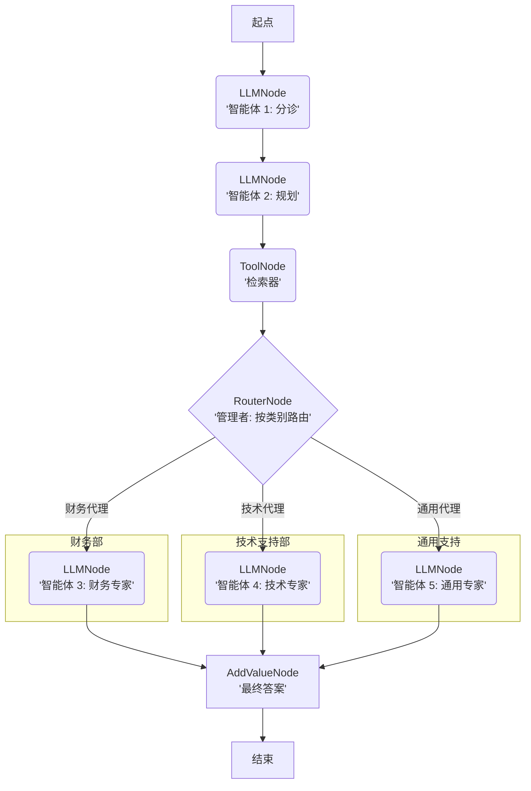

# 指南：多智能体编排

**lar 的真正威力在于构建“多智能体”系统。**

其他框架采用的是“混乱聊天室”模式，即智能体互相交谈，而你只能寄希望于得到一个好结果。`lar` 则是一个确定性的“生产线”。你就是架构师。你构建一个“玻盒”图，将任务路由给专门的智能体，从而确保执行顺序，并审计每一个步骤。

**本指南将构建一个“客服机器人”，它能将任务分流给不同的“专家”智能体。**

### “玻盒”流程图



## 代码实现（“乐高积木”实战）

以下是构建并运行该智能体所需的全部内容。这只是干净、显式的 Python 代码。

```python
from lar import *
from lar.utils import compute_state_diff # (执行器使用)

# 1. 为我们的路由器定义“选择”逻辑
def triage_router_function(state: GraphState) -> str:
    """读取状态中的 'category' 并返回一个路由键。"""
    category = state.get("category", "GENERAL").strip().upper()
    
    if "BILLING" in category:
        return "BILLING_AGENT"
    elif "TECH_SUPPORT" in category:
        return "TECH_AGENT"
    else:
        return "GENERAL_AGENT"

# 2. 定义智能体的节点（即“积木”）
# 我们按照从后到前的顺序进行构建。

# --- 终点节点（目的地） ---
final_node = AddValueNode(key="final_response", value="{agent_answer}", next_node=None)
critical_fail_node = AddValueNode(key="final_status", value="CRITICAL_FAILURE", next_node=None)

# --- “专家”智能体 ---
billing_agent = LLMNode(
    model_name="gemini/gemini-2.0-flash",
    prompt_template="你是一个财务专家。请仅根据此背景回答 '{task}'：{retrieved_context}",
    output_key="agent_answer",
    next_node=final_node
)
tech_agent = LLMNode(
    model_name="gemini/gemini-2.0-flash",
    prompt_template="你是一个技术支持专家。请仅根据此背景回答 '{task}'：{retrieved_context}",
    output_key="agent_answer",
    next_node=final_node
)
general_agent = LLMNode(
    model_name="gemini/gemini-2.0-flash",
    prompt_template="你是一个通用助手。请仅根据此背景回答 '{task}'：{retrieved_context}",
    output_key="agent_answer",
    next_node=final_node
)
    
# --- “管理者”（路由器） ---
specialist_router = RouterNode(
    decision_function=triage_router_function,
    path_map={
        "BILLING_AGENT": billing_agent,
        "TECH_AGENT": tech_agent,
        "GENERAL_AGENT": general_agent
    },
    default_node=general_agent
)
    
# --- “检索器”（工具） ---
# （假设你已经定义了一个 'retrieve_relevant_chunks' 工具）
retrieve_node = ToolNode(
    tool_function=retrieve_relevant_chunks, 
    input_keys=["search_query"],
    output_key="retrieved_context",
    next_node=specialist_router, 
    error_node=critical_fail_node
)
    
# --- “规划器”（LLM） ---
planner_node = LLMNode(
    model_name="gemini/gemini-2.0-flash",
    prompt_template="你是一个搜索查询机器。将此任务转换为搜索查询：{task}。仅回复生成的查询语句。",
    output_key="search_query",
    next_node=retrieve_node
)
    
# --- “分诊”节点（真正的起点） ---
triage_node = LLMNode(
    model_name="gemini/gemini-2.0-flash",
    prompt_template="你是一个分诊机器人。请对该任务进行分类：\"{task}\"。仅回复以下内容之一：BILLING, TECH_SUPPORT, 或 GENERAL。",
    output_key="category",
    next_node=planner_node
)

# 3. 运行智能体
executor = GraphExecutor()
initial_state = {"task": "我该如何重置密码？"}
result_log = list(executor.run_step_by_step(
    start_node=triage_node, 
    initial_state=initial_state
))
```
