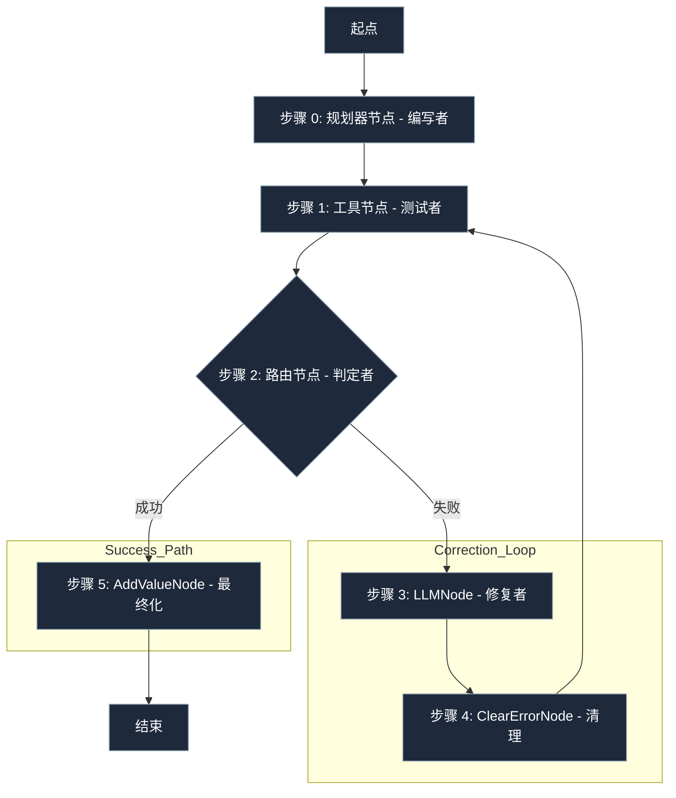

# 指南：自我修复循环

**这是 lar 中最强大的模式。您可以构建一个能够测试其自身工作并循环运行直到达到您的质量标准的智能体。**

**这个“代码修复”智能体将：**

- 编写一段代码。
- 使用 `ToolNode` 测试该代码。
- 使用 `RouterNode` 判定结果。
- 如果测试失败，它将携带确切的错误消息循环回到“修复器” `LLMNode` 并再次尝试。

!!! tip
    **实战演示**
    我们有一个关于此“自我修复”模式的完整、生产就绪的演示。
    请查看 **[代码修复演示 (Code Repair Demo)](https://github.com/snath-ai/code-repair-demo)**。

### “玻盒”流程图

**这是自我修复智能体的“生产线”。**



### 代码实现（“乐高积木”实战）
```python
from lar import *
from lar.utils import compute_state_diff

# 1. 定义“工具”（我们的测试）和“逻辑”
def run_generated_code(code_string: str) -> str:
    """一个用于执行 LLM 生成的代码并运行测试的“工具”。"""
    try:
        local_scope = {}
        exec(code_string, {}, local_scope)
        func = local_scope['add_five']
        result = func(10)
        if result != 15:
            raise ValueError(f"逻辑错误：预期结果为 15，但得到的是 {result}")
        return "成功！"
    except Exception as e:
        raise e # 显式抛出失败

def judge_function(state: GraphState) -> str:
    """我们路由器的“选择”逻辑。"""
    if state.get("last_error"):
        return "failure"
    else:
        return "success"

# 2. 定义智能体的节点（即“积木”）
success_node = AddValueNode(key="final_status", value="SUCCESS", next_node=None)
critical_fail_node = AddValueNode(key="final_status", value="CRITICAL_FAILURE", next_node=None)

# --- “修正循环” ---
tester_node = ToolNode(
    tool_function=run_generated_code,
    input_keys=["code_string"],
    output_key="test_result",
    next_node=None, # 将被设置为判定者
    error_node=None # 将被设置为判定者
)

clear_error_node = ClearErrorNode(
    next_node=tester_node # 清理完毕后，循环回测试者
)

corrector_node = LLMNode(
    model_name="gemini/gemini-2.0-flash",
    prompt_template="您上一次尝试失败了。请修复此代码：{code_string}。错误信息：{last_error}",
    output_key="code_string",
    next_node=clear_error_node
)

# --- “判定者”（路由器） ---
judge_node = RouterNode(
    decision_function=judge_function,
    path_map={
        "success": success_node,
        "failure": corrector_node # 失败时，转到修复者
    },
    default_node=critical_fail_node
)

# --- 将测试者节点链接到判定者 ---
tester_node.next_node = judge_node
tester_node.error_node = judge_node

# --- “起点”节点（规划器/编写者） ---
planner_node = LLMNode(
    model_name="gemini/gemini-2.0-flash",
    prompt_template="编写一个 Python 函数 `add_five(x)`，返回 x + 5 的结果。",
    output_key="code_string",
    next_node=tester_node # 编写完成后，转到测试者
)

# 3. 运行智能体
executor = GraphExecutor()
initial_state = {"task": "编写一个加 5 的函数"}
result_log = list(executor.run_step_by_step(
    start_node=planner_node, 
    initial_state=initial_state
))
```
